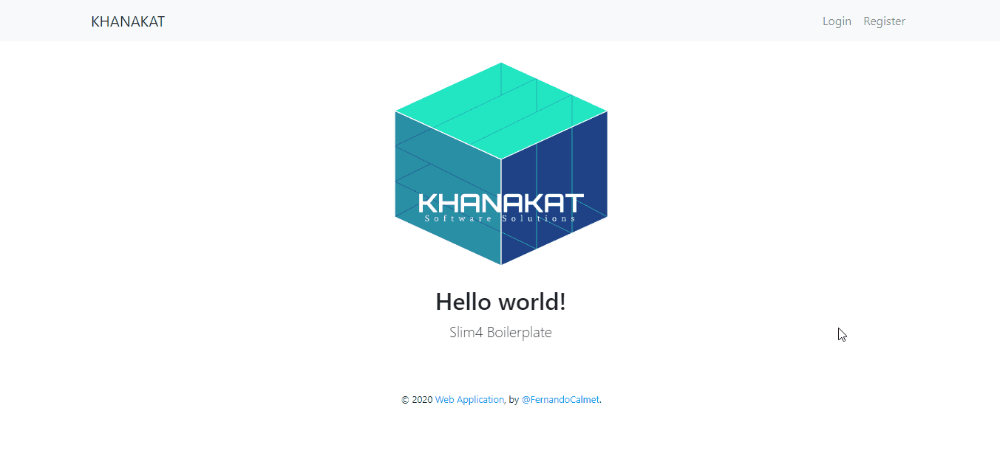

# Aplicación Boilerplate Slim4 + Authentications + Migrations + SQL
> Autor : Fernando Calmet  
https://github.com/fernandocalmet  
----------

## Includes
- Dependency Injection
- Twig templates
- Eloquent ORM
- Easy form validation
- Phinx migrations
- Session based authentication
- CSRF protection middleware
- Config helper
- Symfony var dumper

## Depedencies
- slim/slim
- slim/psr-7
- slim/twig-view
- slim/flash
- slim/csrf
- php-di/slim-bridge
- symfony/var-dumper
- robmorgan/phinx
- illuminate/database
- illuminate/validation
- google/recaptcha

## Demo

## BUY ME A COFFEE :-)
